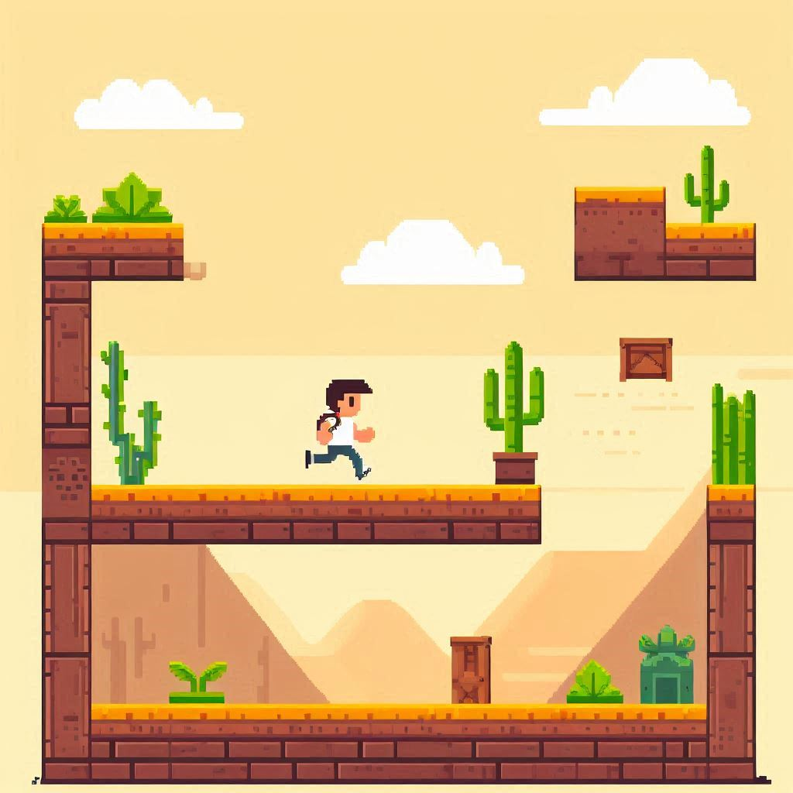
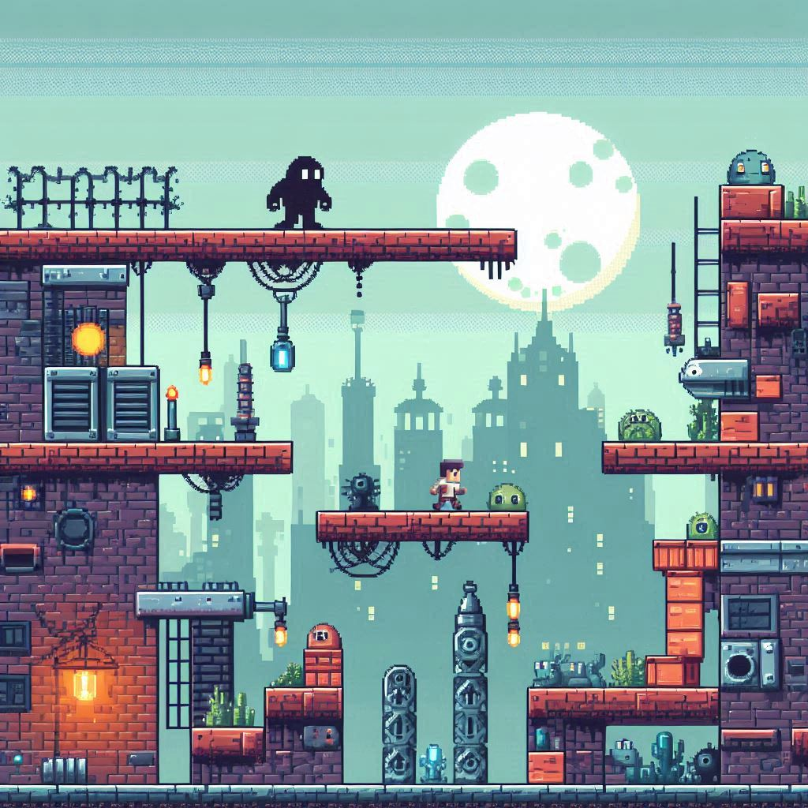
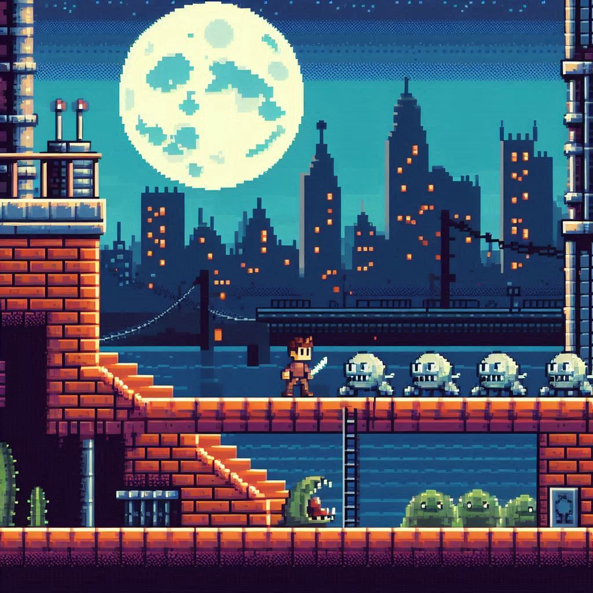
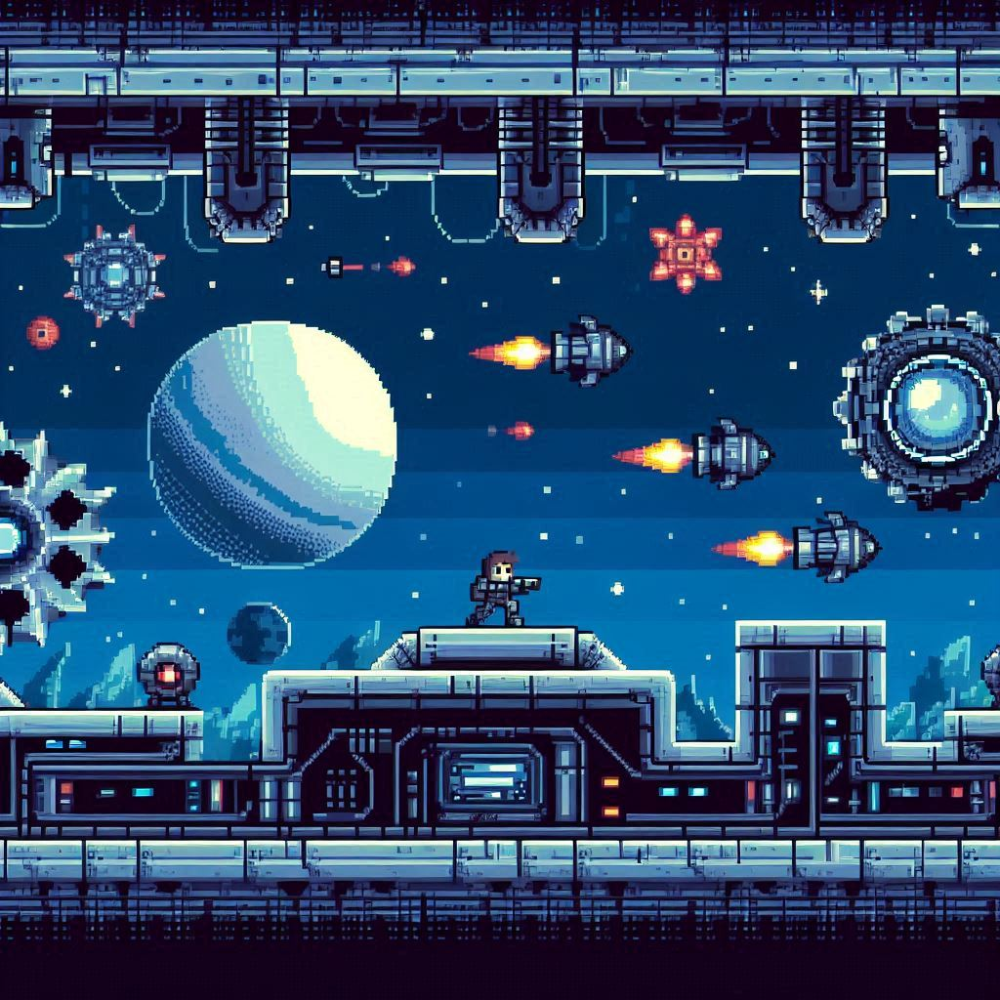

# 🕹️ Platformer Game

## Descripción
**Platformer Game** es un juego de plataformas 2D simple desarrollado en Python usando la librería *PyGame*. El objetivo es guiar al personaje principal a través de varios niveles, sorteando obstáculos y recolectando objetos para alcanzar la meta. Este proyecto es una excelente introducción a la creación de videojuegos y a la programación con *PyGame*.

## Capturas de pantalla 📷

|  |  |
| ---- | ---- |
|  |  |

## Funcionalidades ⚙️
- **Controles sencillos**: Movimiento con teclas de flecha o `WASD`
- **Enemigos y obstáculos**: Evita a los enemigos y sortea diferentes obstáculos a lo largo del camino.
- **Recolección de ítems**: Recoge monedas u objetos especiales para aumentar tu puntaje.
- **Diferentes niveles**: Completa varios niveles, cada uno con un diseño y dificultad únicos.
- **Sonidos y música**: Sonidos ambientales y música de fondo que hacen el juego más entretenido.

## Instalación 💻

### Requisitos previos
Para ejecutar este juego necesitas tener instalados:
- Python 3.8 o superior
- PyGame 2.0 o superior

### Paso a paso
1. Clona el repositorio:
    ```bash
    git clone https://github.com/usuario/platformer-game.git
    cd plataform-game
    ```
2. Instala las dependencias:
    ```bash
    pip install -r requirements.txt
    ```
3. Ejecuta el juego:
    ```bash
    python main.py
    ```

## Controles 🎮
- **Movimiento**: Flechas de dirección o `WASD`.
- **Saltar**: Barra espaciadora.
- **Pausa**: `P`.

## Estructura del Proyecto 🧱
```
plataform-game/
│
├── assets/                  # Imágenes, sonidos y otros recursos gráficos
│   ├── images/
│   ├── sounds/
│   ├── videos/
├── capturas/                # Imagenes del juego
├── levels/                  # Archivos de niveles
├── src/
│   ├── main.py              # Archivo principal para ejecutar el juego
│   ├── player.py            # Lógica del jugador
│   ├── enemy.py             # Lógica de los enemigos
│   ├── platform.py          # Lógica de las plataformas y colisiones
│   └── game.py              # Lógica principal del juego
└── README.md                # Documentación del proyecto
```

## Contribuir 💪
Si deseas contribuir al proyecto, sigue estos pasos:
1. Haz un fork del repositorio.
2. Crea una nueva rama (`git checkout -b feature-nueva-funcionalidad`).
3. Realiza tus cambios y haz un commit (`git commit -m 'Agrega nueva funcionalidad'`).
4. Sube los cambios a tu rama (`git push origin feature-nueva-funcionalidad`).
5. Abre un Pull Request.

## Equipo 🤝
Equipo de Desarrollo: **Maestros del Byte**

**Maestros del Byte** *es un grupo de desarrolladores apasionados por los videojuegos y la programación en Python. Nuestra misión es crear experiencias de juego emocionantes y desafiantes que pongan a prueba tus habilidades y te sumerjan en el mundo de las plataformas clásicas. ¡Esperamos que disfrutes jugando tanto como nosotros disfrutamos desarrollando!*

### Integrantes 🤓

- **Juan Pérez** – *Desarrollador de Gameplay y Física*  
  Juan es el experto en lógica de juego y se encarga de que cada salto, colisión, y movimiento se sienta fluido y natural. Apasionado de la física en los videojuegos, se asegura de que la jugabilidad sea precisa y emocionante.  
  [GitHub](https://github.com/juanperez) 🎮 [LinkedIn](https://linkedin.com/in/juanperez) 🎮 [Twitter](https://twitter.com/juanperez)

- **María García** – *Diseñadora de Niveles y Artista Visual*  
  Con un ojo para el detalle y la creatividad, María diseña los niveles y el aspecto visual del juego. Cada escenario está cuidadosamente diseñado para ofrecer un desafío y una estética atractiva para el jugador.  
  [GitHub](https://github.com/mariagarcia) • [LinkedIn](https://linkedin.com/in/mariagarcia) • [Twitter](https://twitter.com/mariagarcia)

- **Carlos Sánchez** – *Programador de Inteligencia Artificial y Enemigos*  
  Carlos es quien da vida a los enemigos y crea los obstáculos dinámicos. Su conocimiento en inteligencia artificial permite que cada enemigo ofrezca un reto único y adaptativo al jugador.  
  [GitHub](https://github.com/carlossanchez) • [LinkedIn](https://linkedin.com/in/carlossanchez) • [Twitter](https://twitter.com/carlossanchez)

¡Gracias por jugar y apoyar nuestro juego!

## Créditos 📜
Este juego fue desarrolado utilizando la librería [PyGame](https://www.pygame.org/). Agradecimienos especiales a las fuentes de recursos gráficos y de audio disponibles de manera grautita.

## Licencia 🔑
Este proyecto está bajo la licencia MIT. Consulta el archivo `LICENSE` para más detalles.